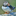

# Pixelating an Image

Converting an image to an 8-bit pixelated version using vanilla PHP and GD library.

The original function logic was inspired by the following Stack Overflow question:

https://stackoverflow.com/questions/5752514/how-to-convert-png-to-8-bit-png-using-php-gd-library

Below are three images representing the original, the PHP converted image, and the same image converted using Photoshop:

  

---

## Project Stack

This project uses vanilla [PHP](https://www.php.net/) and the PGP [GD Library](https://www.php.net/manual/en/book.image.php).

---

## Repo Resources

* [GD Library](https://www.php.net/manual/en/book.image.php)

